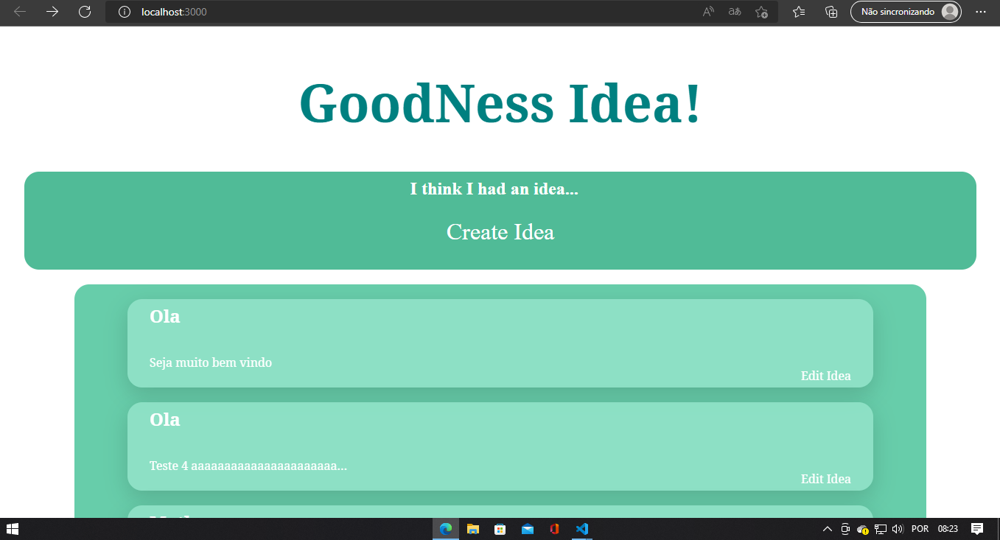

# Good-Idea

Still as a form of practice and training, I'm making an site. It's focus on plurality of ideas, where all users will be able to through blocks, express their ideas,
as a type, so that simpler, of twitter. As such, other users will be able to access these ideas and participate in the conversations.
The content will be presented in the form of a title with the nickname of the creator of the idea, and a subtext to present his ideas - a function to be added will be optional, is add a file to illustrate your ideas - and after that, have comments to add sub-ideas for discussion.

#Technologies that I will use:  
<li>HTML</li>
<li>CSS</li>
<li>JavaScript</li>
<li>React</li>
<li>Node</li>
<li>MongoDB - or an other database manager</li>

